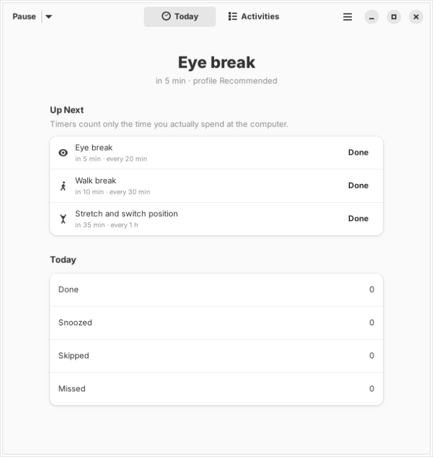
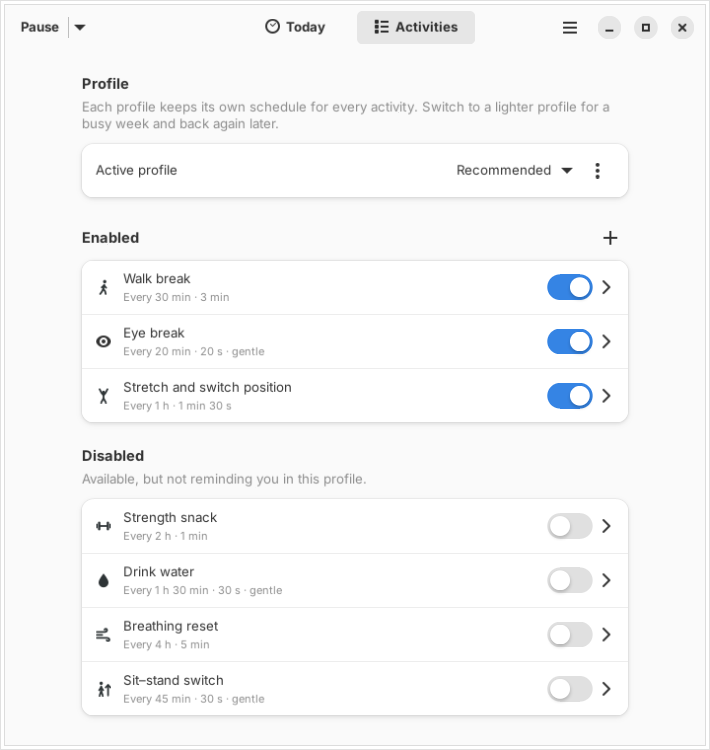
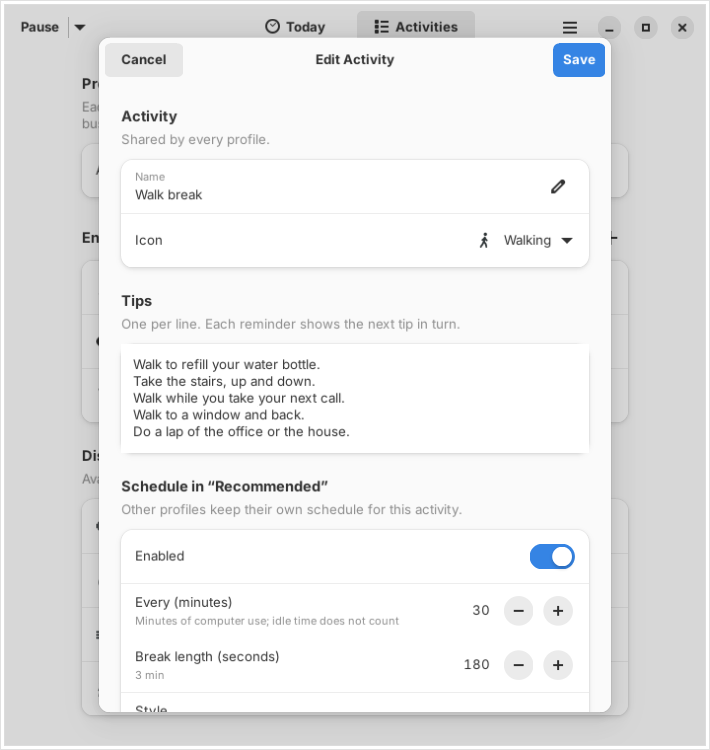

# Movebreak

[](https://github.com/isreb27/movebreak/actions/workflows/ci.yml)
[](LICENSE)

Evidence-based reminders to **move, rest your eyes and stretch** while you work at a
computer, for the GNOME desktop (Ubuntu, Fedora and friends).

<p align="center">
  
  
  
</p>

## Why these reminders?

The defaults follow the research on prolonged sitting, summarised in
[docs/EVIDENCE.md](docs/EVIDENCE.md):

| Activity | Default | Why |
| --- | --- | --- |
| Walk break | every 30 min, 3 min | Short walks every 30 minutes lowered blood sugar and blood pressure; hourly breaks did much less |
| Eye break (20-20-20) | every 20 min, 20 s | Reduces eye strain and dry-eye symptoms while you keep doing it |
| Stretch and switch position | every 60 min | No single posture is "correct"; changing position is what helps |
| Strength snack, water, breathing, sit–stand | off (opt-in) | Useful, but the evidence for scheduled reminders is weaker |

Standing alone is not a substitute for moving, and "sit up straight" reminders are
deliberately left out. Movebreak is not medical advice; if you have persistent pain,
see a physiotherapist.

## Features

- **Counts active time, not clock time.** Idle time, a locked screen and suspend never
  trigger stale reminders. Being away long enough counts as having taken the break.
- **Gentle by design.** Reminders due close together are merged, they are at least
  5 minutes apart, and a walk also counts as an eye break. The recommended profile
  produces about four prompts an hour, two of them silent eye-break banners.
- **Answer from the notification:** Done, Snooze or Skip. Gentle reminders disappear by
  themselves.
- **Choose how reminders appear:** GNOME's standard banner, a banner that stays until you
  answer it, or a full-screen **break screen** with the tips and a countdown.
- **Custom activities** (push-ups, anything) with their own schedule, tips and icon.
- **Profiles:** *Recommended*, *Light* and *Eyes first* built in, plus your own. Switch
  to a lighter schedule for a busy week and back again later.
- **Pause** for 30 minutes, an hour, until tomorrow or until you resume, from the
  window, the top-bar icon, the command line or a keyboard shortcut.
- **Optional top-bar icon** with the next break and a pause menu (Ubuntu shows it out of
  the box; on Fedora, install the GNOME extension "AppIndicator and KStatusNotifierItem
  Support").
- **Private:** no network access, no telemetry. Everything stays in one local file.

## Install

Movebreak needs Python 3.11+, PyGObject, GTK 4 and libadwaita 1.5+. GNOME desktops
usually have all of them already.

### Without administrator rights (for example, a work computer)

No `sudo` needed: everything goes into `~/.local`.

```sh
git clone https://github.com/isreb27/movebreak.git
cd movebreak
python3 scripts/install.py
```

The installer checks the dependencies first. Then open **Movebreak** from the app grid,
turn on **Start at Login** in Preferences, and run `movebreak doctor` to check what your
computer supports (see [Checking your system](#checking-your-system)).

If the installer reports that GTK 4 or libadwaita cannot be loaded, ask your IT team to
install `python3-gi gir1.2-gtk-4.0 gir1.2-adw-1` (Ubuntu), or use the Flatpak build if
`flatpak --version` works on that computer.

### Fedora (Flatpak, recommended)

Fedora ships Flatpak. Build and install for your user only:

```sh
flatpak remote-add --user --if-not-exists flathub https://dl.flathub.org/repo/flathub.flatpakrepo
flatpak install --user flathub org.gnome.Platform//50 org.gnome.Sdk//50 org.flatpak.Builder
flatpak run org.flatpak.Builder --user --install --force-clean build-dir \
    build-aux/flatpak/io.github.isreb27.Movebreak.json
flatpak run io.github.isreb27.Movebreak
```

The Flatpak version is sandboxed, asks GNOME for permission to start at login, and shows
its status ("Next: Walk break in 12 min") in **Quick Settings › Background Apps**.
`python3 scripts/install.py` works on Fedora too.

### Uninstall

```sh
python3 scripts/install.py --uninstall          # keeps your settings and history
python3 scripts/install.py --uninstall --purge  # deletes them too
flatpak uninstall --user io.github.isreb27.Movebreak   # Flatpak build
```

## Usage

Closing the window does not stop the reminders; **Quit** in the main menu (or in the
top-bar icon's menu) does. In GNOME System Monitor the running app is listed as
**Movebreak**.

| Command | What it does |
| --- | --- |
| `movebreak` | Open the window (starts the reminders if needed) |
| `movebreak --background` | Start without a window (this is what runs at login) |
| `movebreak pause [MINUTES]` | Pause for MINUTES, or until you resume |
| `movebreak resume` | Resume |
| `movebreak status` | Show the profile and what is due next |
| `movebreak profile [NAME]` | List profiles, or switch to NAME |
| `movebreak doctor [quick]` | Check this computer's support; `quick` skips the notification test |

With the Flatpak build, prefix commands with `flatpak run io.github.isreb27.Movebreak`.

**Pause with a keyboard shortcut:** Settings › Keyboard › View and Customise Shortcuts ›
Custom Shortcuts › **+**. Use the command `~/.local/bin/movebreak pause 60` (full path)
and a shortcut such as <kbd>Super</kbd>+<kbd>Alt</kbd>+<kbd>P</kbd>.

**Sound and Do Not Disturb** are GNOME settings: Settings › Notifications › Movebreak.

If you use Movebreak, turn off GNOME's own break reminders (Settings › Wellbeing) to
avoid double prompts.

## Checking your system

`movebreak doctor` checks everything Movebreak relies on, on the machine where it runs
(natively or inside the Flatpak sandbox), then sends a test notification and waits for
you to click a button. A healthy report looks like this:

```text
Movebreak doctor

✓ Versions             Movebreak 0.3.0, Python 3.12.3, GTK 4.14.5, libadwaita 1.5.0, GLib 2.80.0
✓ Session              GNOME on wayland, native install
✓ Desktop file         installed: notifications can be shown
✓ Idle detection       Mutter IdleMonitor reachable (idle for 0 s)
✓ Screen lock          readable (currently unlocked)
✓ Do Not Disturb       readable (currently off)
· Background portal    version 2; status line not used outside Flatpak (…)
· Start at login       off; turn it on in Preferences. Command: …
✓ Top-bar icon         tray host available (toggle it in Preferences)

Sending a test notification. Click one of its buttons within 60 s (or press Ctrl+C to stop)…
✓ Button “done” clicked: notification buttons work.
```

[docs/TROUBLESHOOTING.md](docs/TROUBLESHOOTING.md) explains each line, gives the manual
`gdbus` commands behind every check, and lists fixes for common problems.

## How it works

A pure-Python core (scheduler, profiles, SQLite store) sits under thin GNOME adapters
(idle and lock detection over D-Bus, notifications, autostart) and a GTK 4 / libadwaita
UI. See [docs/ARCHITECTURE.md](docs/ARCHITECTURE.md).

## Contributing

Bug reports, translations and pull requests are welcome. Start with
[CONTRIBUTING.md](CONTRIBUTING.md). Please follow the [code of conduct](CODE_OF_CONDUCT.md).

## License

[GPL-3.0-or-later](LICENSE). Metadata files are CC0-1.0.
